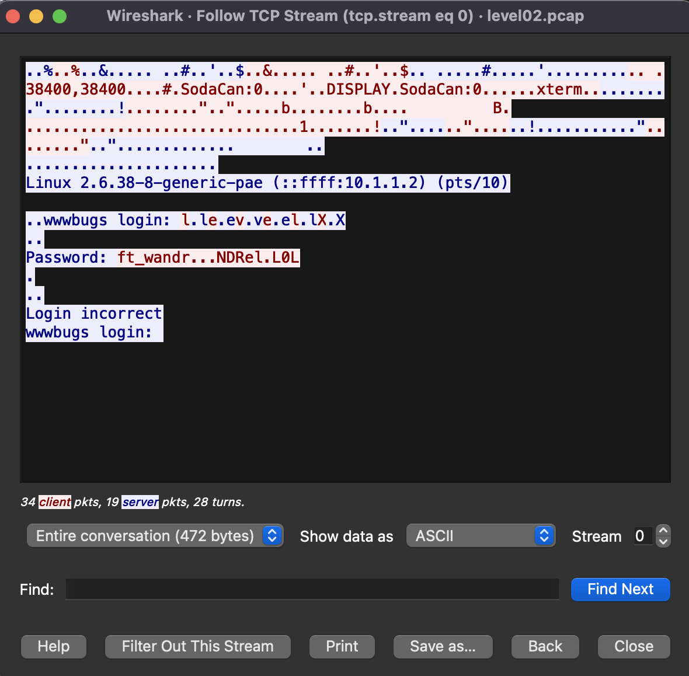
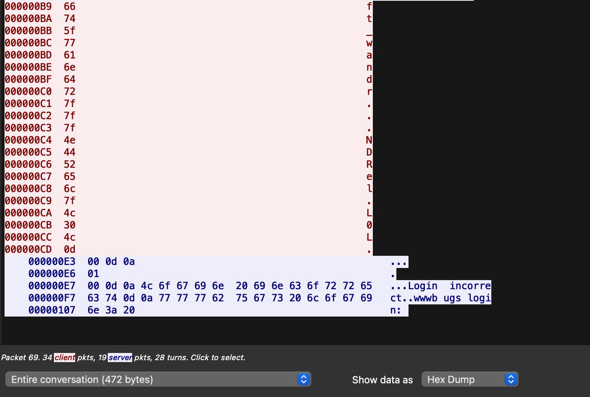

#### 1. The password of level02 is the token from level01.

```
f2av5il02puano7naaf6adaaf

```
#### 2. So, try login to level02 with the password we got from level01 and try to put the command 'ls'. We can see the file 'level01.pcap'. 

```
level01@SnowCrash:~$ su level02
Password:f2av5il02puano7naaf6adaaf
level02@SnowCrash:~$ ls
level02.pcap
```

#### 3. So, what is a PCAP file? You can check the detail answer the following link. 

[What is a PCAP file?](https://www.endace.com/learn/what-is-a-pcap-file)

pcap (short for Packet Capture) file is a binary file format used to store network packet data captured during network traffic monitoring or analysis. These files can be created by various packet sniffing tools and network monitoring software. The format is widely supported, making it a standard way to store and exchange captured network data.

#### 4. As explained in the link, for read the PCAP file, we will use the program Wireshark. To open ths pcap file, we will safely copy level02.pcap file in "another local terminal" and we will open with a tool "WireShark"

```
scp -P 4242 level02@127.0.0.1:/home/user/level02/level02.pcap /tmp
```

#### 5. Go look for /tmp in terminal and we successfully downloaded the pcap file.

```
level02.pcap      100% 8302     8.1KB/s   00:00

```
#### 6. Open the pcap file with WireShark. We found the clue of the password as you can see the foloowing image.


#### 7. To know more details of TCP Packets, clicked the "Follow TCP Stream" dialog box. The stream content is displayed in the same sequence as it appeared on the network.

TCP Streams are "Segmented and Shipped by IP Packets".

TCP sends its data in little chunks called IP packets (or IP datagrams). In this way, HTTP is the top layer in a "protocol stack” of “HTTP over TCP over IP,”



we can see the clue of the password as below. But this is still NOT the correct password.

```
Password: ft_wandr...NDRel.L0L
```
In this case, let's change display to "hexdump" And let's see if they're correctly corresponded to the HEX number and see if they're printable.



|HEX|66 |74 |5f |77 |61 |6e |64 |72 |7f | 7f| 7f|4e | 44| 52| 65| 6c| 7f| 4c| 30| 4c| 0d   |
|---|---|---|---|---|---|---|---|---|---|---|---|---|---|---|---|---|---|---|---|---|------|
|Ascii|f  | t | _ |  w|  a|  n|  d|  r|DEL|DEL|DEL|  N|  D|  R|  e|  l|DEL| L | 0 |  L|RETURN|

HEX 7f corresponded to DEL : So, n, d, r will be deleted and same for l.
HEX 0d corresponded to CARRIAGE_RETURN ('\r') : so it represent the end of the line.
So, password should be from ft_wandr...NDRel.L0L to ft_waNDReL0L

So, we found our password! Let's put our password into flag02


```
level02@SnowCrash:~$ su flag02
Password: 
Don't forget to launch getflag !
flag02@SnowCrash:~$ getflag
Check flag.Here is your token : kooda2puivaav1idi4f57q8iq
flag02@SnowCrash:~$ ^C
flag02@SnowCrash:~$ 
```

8. We got a token for next level03
```
kooda2puivaav1idi4f57q8iq
```